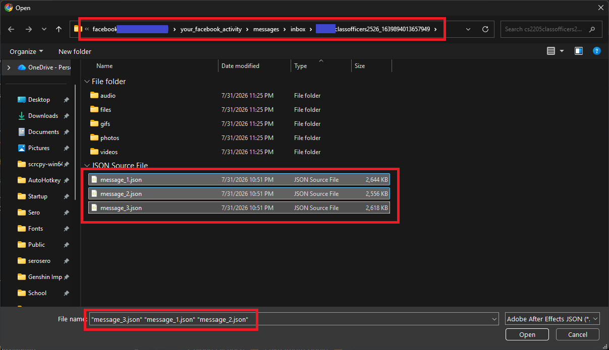
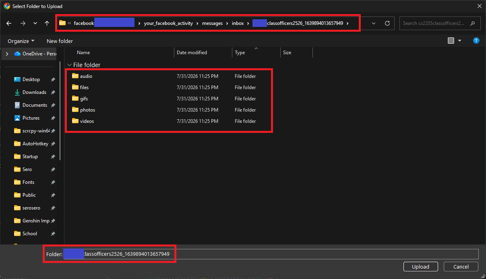
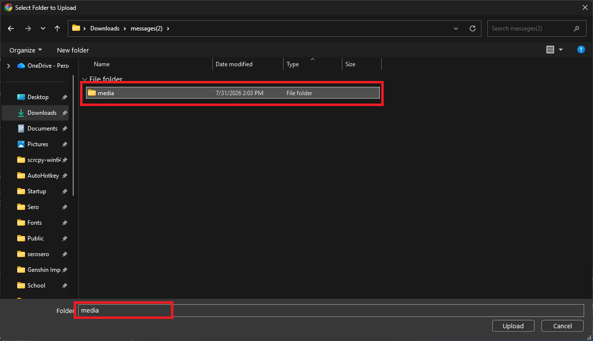
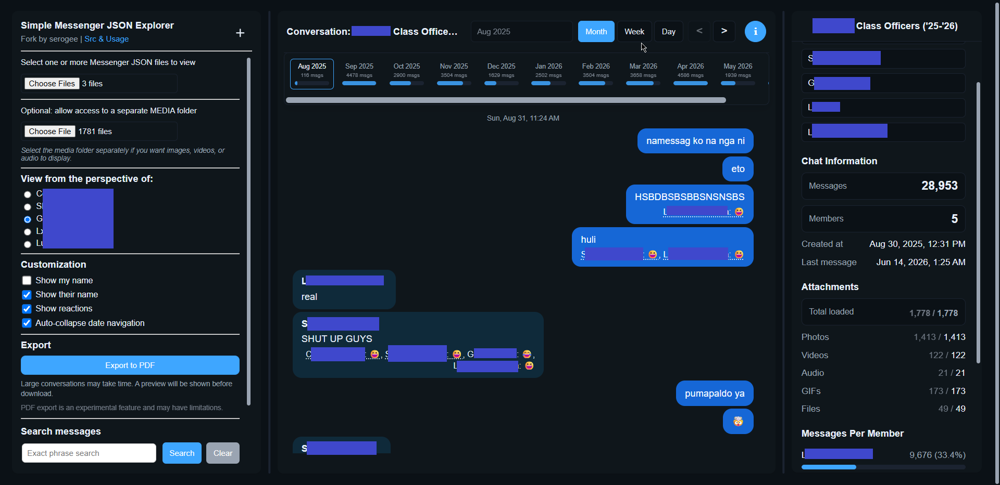

# Simple Messenger JSON Explorer

[Open the Messenger JSON viewer](https://serogee.github.io/Simple-Messenger-JSON-Explorer/) · [Read the usage guide](https://serogee.github.io/Simple-Messenger-JSON-Explorer/guide.html)

## Overview
Simple Messenger JSON Explorer is a browser-based tool for viewing and analyzing Facebook Messenger JSON exports in a readable chat interface. It runs locally in your browser, so selected message and media files stay on your device.

This project is a fork of [DuckCIT/Facebook-Messenger-JSON-Viewer](https://github.com/DuckCIT/Facebook-Messenger-JSON-Viewer). Credit and thanks go to DuckCIT for the original viewer.

## Features
- **Multi-file JSON loading**: Select one or more Messenger JSON files and merge split message exports into one conversation.
- **Date navigation**: Jump through long conversations by month, week, or day, with scroll-aware navigation.
- **Exact phrase search**: Search messages with stable highlights that preserve scroll position.
- **Media support**: View images, videos, GIFs, and audio files when a matching media folder is selected.
- **Chat info panel**: Review members, message counts, date range, per-member activity, and attachment totals.
- **Resizable panels**: Resize the settings and chat information panels, with widths saved in browser storage.
- **Customization options**: Show or hide sender names and reactions, toggle date navigation behavior, and switch dark mode.
- **Export to PDF (Experimental)**: Export the rendered conversation to a PDF file with preview and progress.
- **Responsive design**: Adapts to different screen sizes for better usability on mobile devices.

## Usage
1. Export your Facebook Messenger data from Facebook.
2. [Open Simple Messenger JSON Explorer](https://serogee.github.io/Simple-Messenger-JSON-Explorer/) or use your local copy.
3. Select one or more Messenger `.json` files. If your export contains split files like `message_1.json`, `message_2.json`, and so on, you can select them together.

4. Optional: select the media folder if you want images, videos, GIFs, or audio to display.

**There are two common media folder cases:**
1. For a standard Facebook data export, select the message folder that contains the JSON and media files.

2. For Messenger end-to-end encrypted chat exports, select the separate media folder.

## Detailed Features

### JSON Parsing
The tool parses Facebook Messenger JSON exports, supports selecting multiple JSON files at once, merges split message files, normalizes message order, and keeps participant metadata together.

### Date Navigation
Long conversations can be navigated by month, week, or day. The active date updates as you scroll, and navigation controls can jump directly to a selected date bucket.

### Search
Exact phrase search helps locate messages without fuzzy matches. Search highlights are applied without changing message layout or unexpectedly shifting the scroll position.

### Customization Options
Users can customize the display of messages with the following options:
- **Show My Name**: Display or hide the user's name in the messages.
- **Show Their Name**: Display or hide the other participants' names in the messages.
- **Show Reactions**: Display or hide reactions to the messages.
- **Auto-collapse Date Navigation**: Automatically keep date controls compact when browsing.
- **Dark Mode**: Switch the interface theme.

### Chat Information
The chat info panel summarizes the loaded conversation, including members, message totals, date range, messages per member, and reported versus loaded attachment counts.

### Export to PDF (Experimental)
The app can export the conversation view to PDF with a preview and progress indicator.

Notes:
- The PDF is generated entirely in your browser.
- This feature is experimental and may have limitations.
- Some media elements (especially audio/video) may be replaced by placeholders in the exported PDF.
- Very large conversations may be blocked or require confirmation to avoid browser slowdowns.

**DEMO**

## Search Console setup for maintainers

Publish `index.html`, `guide.html`, `sitemap.xml`, and `googled6f4523e7e718b86.html` from the repository root through GitHub Pages. Keep the verification filename and contents intact.

1. Add `https://serogee.github.io/Simple-Messenger-JSON-Explorer/` as a URL-prefix property in [Google Search Console](https://search.google.com/search-console/).
2. Choose HTML file verification. Confirm that Google gives you the same verification file, then open [the published file](https://serogee.github.io/Simple-Messenger-JSON-Explorer/googled6f4523e7e718b86.html) and click **Verify** in Search Console. Keep the file after verification. If Google gives you a different file, publish that file beside `index.html`.
3. Inspect the homepage and guide URLs. Use **Test live URL**, then **Request indexing** for eligible pages.
4. Submit `https://serogee.github.io/Simple-Messenger-JSON-Explorer/sitemap.xml` under **Sitemaps**. Check the indexing and performance reports as Google collects data.

Set the repository's **About → Website** field to the homepage URL on GitHub. If you deploy a fork at another address, update the canonical URLs, sitemap entries, and README links for your site, and use your own verification file.

Follow [Google's ownership verification instructions](https://support.google.com/webmasters/answer/9008080) and [sitemap guidance](https://developers.google.com/search/docs/crawling-indexing/sitemaps/build-sitemap). Google reads `robots.txt` from the host root (`https://serogee.github.io/robots.txt`); a copy inside this project's subdirectory would not control crawling.

## License
This project is licensed under the MIT License. See the [LICENSE](LICENSE) file for more information. This fork preserves credit to the original project, [DuckCIT/Facebook-Messenger-JSON-Viewer](https://github.com/DuckCIT/Facebook-Messenger-JSON-Viewer).

## Contact
For questions, feedback, or issues with this fork, please use the repository at [serogee/Simple-Messenger-JSON-Explorer](https://github.com/serogee/Simple-Messenger-JSON-Explorer).
